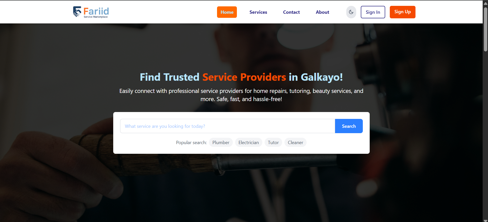
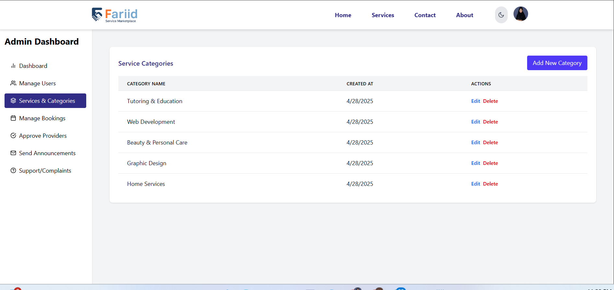

# Fariid Service Marketplace


Fariid Service Marketplace is a local service platform designed to connect customers with trusted service providers in Galkayo. The platform supports role-based dashboards for Admins, Service Providers, and Customers. It features a clean, responsive UI with light and dark modes, secure authentication, and fully functional CRUD operations, built with ReactJS, TailwindCSS, Supabase, and React Router.

---
### 🧩 UX/UI Design

Explore the Figma design for Fariid Service Marketplace:

🔗 [View Figma Design](https://www.figma.com/design/tJHF8NteJsI2Pv4NgEzlOM/Fariid-service-marketplace?node-id=0-1&p=f&t=lX4xcB1kRbqPtSSw-0)


## Preview Images





---

## Technologies Used

- ReactJs
- TailwindCSS

- React Router DOM

- Supabase (Auth + Database)

- Context API

- React Icons

- React Hot Toast

---

## Features Overview

### 1. Pages
- **Home Page**: Hero section with rotating images, search bar, popular categories, most popular services, testimonials from users, FAQs.
- **Services Page**: Search services, filter by category and price (basic, standard, premium), sort by highest/lowest price or rating.
- **Service Details Page**: View full service details, provider information, start booking or contact provider.
- **About Page**: Mission, vision, and values of the Fariid Service Marketplace.
- **Contact Page**: Contact form to send messages and find contact details.
- **Dashboard**: Role-based dashboard for Admin, Service Provider, and Customer.
- **Profile Page**: Users can update their name, profile image, and change their password.

---

### 2. Authentication
- Signup: Users can register as either Service Provider or Customer with username, email, password (and confirmation).
- Signin: Login via email and password.
- Authenticated pages using Context + Supabase Auth.

---

### 3. Dashboard Based on Role

#### Admin Dashboard


- Overview of total users, service providers, services, categories, latest users, and latest services.
- Manage users: Verify or block users.
- Manage categories: Add, edit, delete categories.
- Manage bookings from customers.
- Approve or reject service providers' services.


#### Service Provider Dashboard


- Overview of active services, total bookings, and pending bookings.
- Add new services, update, delete existing services.
- View bookings: Manage status (cancelled or completed), view booking details.
- Messages: Receive, reply, and delete messages from customers.

#### Customer Dashboard


- Overview of total, completed, and upcoming bookings.
- Book services by selecting basic/standard/premium pricing.
- Select booking time, village location (e.g., Garsoor, Israac, Yamays), and mobile number.
- Manage messages with providers (send, receive, reply).

---

### 4. Common Components
- **Header**: Shared across all pages with navigation links.
- **Footer**: Shared across all pages with platform information.

---

### 5. UI/UX
- Light mode and dark mode supported.
- Fully responsive and mobile-friendly design.
- Organized component structure.

---

### 6. Backend and CRUD Operations
- Supabase used for authentication and database operations.
- Full CRUD:
  - Service management (Create, Read, Update, Delete).
  - Categories Management.
  - Bookings management.
  - Messaging system between customers and providers.
  - Profile management (Update name, profile image, and password).

---

### 7. Future Enhancements
- Integrate real payment system (currently simulated only).
- Implement advanced notifications.
- Explore AI integration for service recommendations.

---

## Folder Structure

```bash
/src
  /assets
   /components
    AdminDashboard.jsx
    AdminServiceList.jsx
    BookingForm.jsx
    BookingsManagement.jsx
    BookingsTable.jsx
    CustomerDashboard.jsx
    Footer.jsx
    Header.jsx
    MessageDetailModal.jsx
    MessageList.jsx
    MessageModal.jsx
    ProtectedRoute.jsx
    ProviderDashboard.jsx
    ProviderDashboardOverview.jsx
    ServiceRegistration.jsx
    ThemeToggle.jsx
    UnAuthenticatedRoute.jsx
  /contexts
    AuthContext.jsx
    ThemeContext.jsx
  /lib
    auth.js
    supabase.js
  /pages
    AboutPage.jsx
    ContactPage.jsx
    Dashboard.jsx
    HomePage.jsx
    ProfilePage.jsx
    ServiceDetails.jsx
    ServicesPage.jsx
    SignInPage.jsx
    SignUpPage.jsx
  App.jsx
  index.css
  main.jsx

```

---

## Setup Instructions

1. Clone the repository

```bash
git clone https://github.com/Nasrah-muse/Fariid-service-marketplace.git
```

2. Install dependencies

```bash
npm install
```

4. Start the development server

```bash
npm run dev
```

---

## Conclusion

Fariid Service Marketplace is a complete local service platform that empowers users to book trusted services easily and enables providers to manage their offerings effectively. It is built with modern technologies following best practices in design, structure, and functionality.

---

## Explore Fariid Service Marketplace

You can explore the live version of the Fariid Service Marketplace here:

[Fariid Servive Marketplace - Live Demo](https://fariiid.netlify.app/) 

Thank you for exploring Fariid! We hope this documentation provides a thorough understanding of the project.

 
